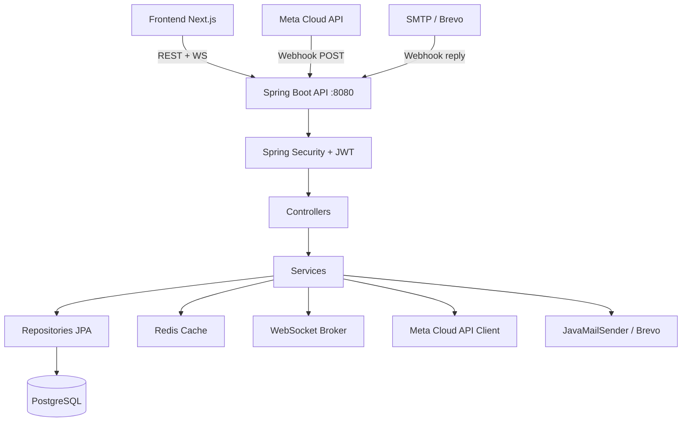
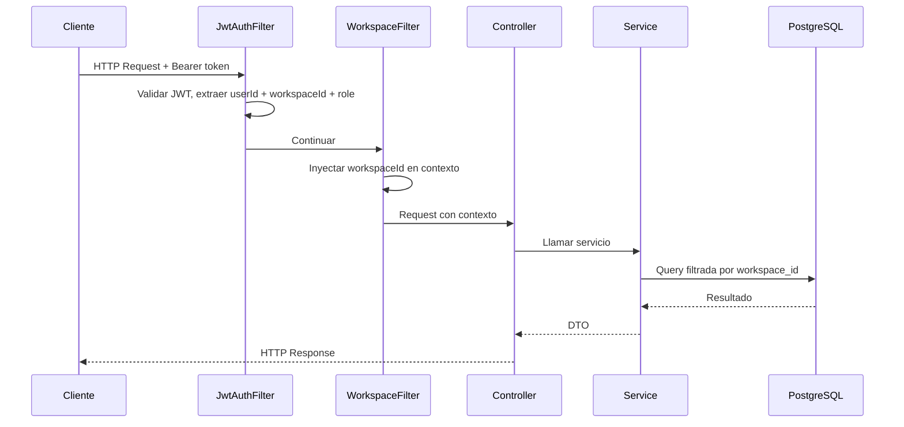
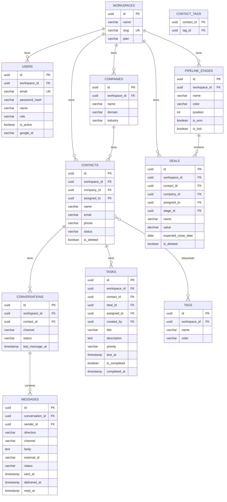
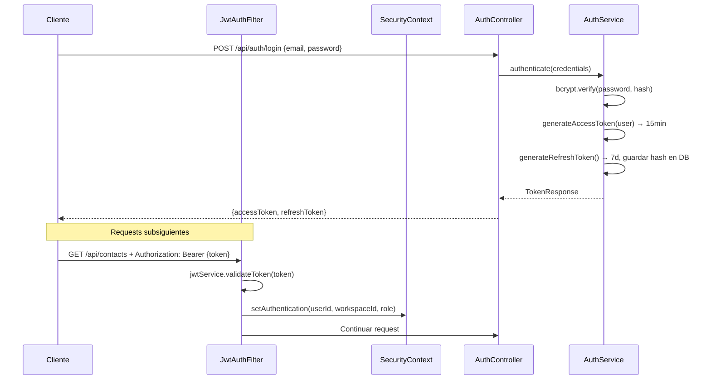
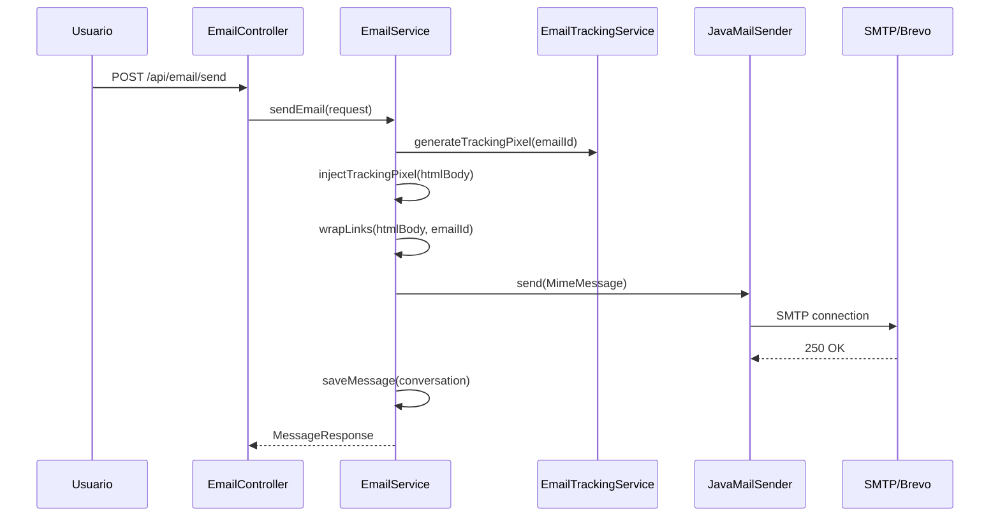
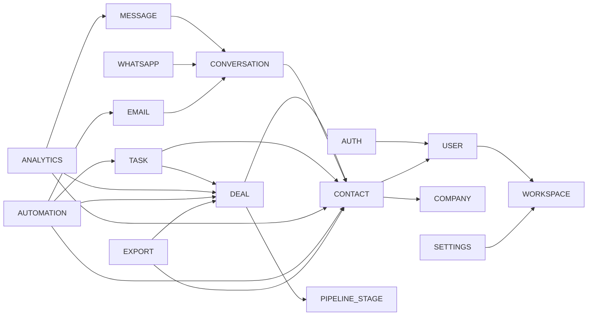

# Documento de Diseño: CRM Backend

## Dependencias Spring Initializr

**URL**: https://start.spring.io

| Campo | Valor |
|-------|-------|
| Project | Maven |
| Language | Java |
| Spring Boot | 3.3.x |
| Group | com.crm |
| Artifact | startup-crm |
| Name | startup-crm |
| Package name | com.crm |
| Packaging | Jar |
| Java | 17 |

### Dependencias a seleccionar

| Categoría | Dependencia | Descripción |
|-----------|-------------|-------------|
| Web | Spring Web | REST controllers, Tomcat embebido |
| Web | Spring WebSocket | WebSocket para tiempo real |
| Security | Spring Security | Autenticación y autorización |
| Data | Spring Data JPA | ORM con Hibernate |
| Data | PostgreSQL Driver | Driver JDBC para PostgreSQL |
| Data | Flyway Migration | Migraciones de base de datos |
| Data | Spring Data Redis | Cache y sesiones con Redis |
| Messaging | Spring for Apache Kafka | Eventos asíncronos (opcional) |
| I/O | Java Mail Sender | Envío de emails SMTP |
| I/O | Spring Validation | Validación de DTOs con Bean Validation |
| Developer Tools | Lombok | Reducción de boilerplate |
| Developer Tools | Spring Boot DevTools | Hot reload en desarrollo |
| Ops | Spring Boot Actuator | Health checks y métricas |
| Testing | Spring Boot Test | JUnit 5 + Mockito |

### Dependencias adicionales (agregar en pom.xml manualmente)

```xml
<!-- JWT -->
<dependency>
  <groupId>io.jsonwebtoken</groupId>
  <artifactId>jjwt-api</artifactId>
  <version>0.12.6</version>
</dependency>
<dependency>
  <groupId>io.jsonwebtoken</groupId>
  <artifactId>jjwt-impl</artifactId>
  <version>0.12.6</version>
  <scope>runtime</scope>
</dependency>
<dependency>
  <groupId>io.jsonwebtoken</groupId>
  <artifactId>jjwt-jackson</artifactId>
  <version>0.12.6</version>
  <scope>runtime</scope>
</dependency>

<!-- Google OAuth2 -->
<dependency>
  <groupId>org.springframework.boot</groupId>
  <artifactId>spring-boot-starter-oauth2-client</artifactId>
</dependency>

<!-- OpenAPI / Swagger -->
<dependency>
  <groupId>org.springdoc</groupId>
  <artifactId>springdoc-openapi-starter-webmvc-ui</artifactId>
  <version>2.6.0</version>
</dependency>

<!-- MapStruct (mapeo DTO ↔ Entity) -->
<dependency>
  <groupId>org.mapstruct</groupId>
  <artifactId>mapstruct</artifactId>
  <version>1.6.3</version>
</dependency>
<dependency>
  <groupId>org.mapstruct</groupId>
  <artifactId>mapstruct-processor</artifactId>
  <version>1.6.3</version>
  <scope>provided</scope>
</dependency>

<!-- Apache Commons / Utilidades -->
<dependency>
  <groupId>org.apache.commons</groupId>
  <artifactId>commons-lang3</artifactId>
</dependency>

<!-- OpenCSV (exportación CSV) -->
<dependency>
  <groupId>com.opencsv</groupId>
  <artifactId>opencsv</artifactId>
  <version>5.9</version>
</dependency>

<!-- iText (exportación PDF) -->
<dependency>
  <groupId>com.itextpdf</groupId>
  <artifactId>itext7-core</artifactId>
  <version>8.0.5</version>
  <type>pom</type>
</dependency>
```

---

## Overview

Backend del CRM inteligente para startups construido con Java 17 + Spring Boot 3.3 + PostgreSQL. Expone una API REST con autenticación JWT, WebSockets para mensajería en tiempo real, integración con WhatsApp Cloud API (Meta) y email (SMTP/Brevo), y soporte multi-workspace con aislamiento completo por `workspace_id`.

El sistema reemplaza la integración Twilio existente por Meta Cloud API, manteniendo la misma interfaz `WhatsAppProvider` para facilitar la migración.

---

## Arquitectura General



### Flujo de Request



---

## Stack Tecnológico

| Componente | Tecnología | Versión |
|------------|------------|---------|
| Lenguaje | Java | 17 LTS |
| Framework | Spring Boot | 3.3.x |
| ORM | Spring Data JPA + Hibernate | 6.x |
| Base de datos | PostgreSQL | 16 |
| Migraciones | Flyway | 10.x |
| Cache | Redis | 7.x |
| Seguridad | Spring Security + JWT (jjwt) | 0.12.x |
| WebSocket | Spring WebSocket + STOMP | - |
| Email | JavaMailSender + Brevo API | - |
| WhatsApp | Meta Cloud API (HTTP client) | v20.0 |
| Documentación | SpringDoc OpenAPI (Swagger UI) | 2.6.x |
| Mapeo | MapStruct | 1.6.x |
| Build | Maven | 3.9.x |
| Contenedor | Docker + Docker Compose | - |


---

## Estructura de Paquetes

```
src/main/java/com/crm/
├── StartupCrmApplication.java
│
├── config/
│   ├── SecurityConfig.java          # Spring Security + JWT filter chain
│   ├── WebSocketConfig.java         # STOMP WebSocket broker
│   ├── RedisConfig.java             # Cache configuration
│   ├── OpenApiConfig.java           # Swagger / SpringDoc
│   └── AppProperties.java           # @ConfigurationProperties
│
├── common/
│   ├── exception/
│   │   ├── GlobalExceptionHandler.java   # @RestControllerAdvice
│   │   ├── ResourceNotFoundException.java
│   │   ├── ForbiddenException.java
│   │   └── ConflictException.java
│   ├── dto/
│   │   ├── ApiResponse.java              # Wrapper genérico de respuesta
│   │   └── PageResponse.java             # Wrapper paginado
│   ├── security/
│   │   ├── JwtService.java               # Generar/validar tokens
│   │   ├── JwtAuthFilter.java            # OncePerRequestFilter
│   │   └── WorkspaceContext.java         # ThreadLocal workspace_id
│   └── audit/
│       └── AuditableEntity.java          # @MappedSuperclass con created_at, updated_at
│
├── module/
│   ├── auth/
│   │   ├── controller/AuthController.java
│   │   ├── service/AuthService.java
│   │   ├── dto/LoginRequest.java
│   │   ├── dto/RegisterRequest.java
│   │   ├── dto/TokenResponse.java
│   │   └── dto/RefreshRequest.java
│   │
│   ├── user/
│   │   ├── controller/UserController.java
│   │   ├── service/UserService.java
│   │   ├── repository/UserRepository.java
│   │   ├── entity/User.java
│   │   ├── entity/UserRole.java          # Enum: ADMIN, MANAGER, SALES
│   │   └── dto/UserDto.java
│   │
│   ├── workspace/
│   │   ├── controller/WorkspaceController.java
│   │   ├── service/WorkspaceService.java
│   │   ├── repository/WorkspaceRepository.java
│   │   ├── entity/Workspace.java
│   │   └── dto/WorkspaceDto.java
│   │
│   ├── contact/
│   │   ├── controller/ContactController.java
│   │   ├── service/ContactService.java
│   │   ├── repository/ContactRepository.java
│   │   ├── entity/Contact.java
│   │   ├── entity/ContactStatus.java     # Enum: NEW, CONTACTED, QUALIFIED, LOST, CONVERTED
│   │   ├── entity/Tag.java
│   │   ├── entity/Note.java
│   │   └── dto/
│   │
│   ├── company/
│   │   ├── controller/CompanyController.java
│   │   ├── service/CompanyService.java
│   │   ├── repository/CompanyRepository.java
│   │   ├── entity/Company.java
│   │   └── dto/
│   │
│   ├── deal/
│   │   ├── controller/DealController.java
│   │   ├── service/DealService.java
│   │   ├── repository/DealRepository.java
│   │   ├── entity/Deal.java
│   │   ├── entity/DealStage.java
│   │   ├── entity/PipelineStage.java
│   │   └── dto/
│   │
│   ├── conversation/
│   │   ├── controller/ConversationController.java
│   │   ├── service/ConversationService.java
│   │   ├── repository/ConversationRepository.java
│   │   ├── repository/MessageRepository.java
│   │   ├── entity/Conversation.java
│   │   ├── entity/Message.java
│   │   ├── entity/MessageChannel.java    # Enum: WHATSAPP, EMAIL
│   │   ├── entity/MessageDirection.java  # Enum: INBOUND, OUTBOUND
│   │   └── dto/
│   │
│   ├── whatsapp/
│   │   ├── controller/WhatsAppWebhookController.java
│   │   ├── service/WhatsAppService.java
│   │   ├── provider/WhatsAppProvider.java          # Interface (migrada)
│   │   ├── provider/MetaCloudWhatsAppProvider.java # Nueva implementación
│   │   ├── config/WhatsAppConfig.java
│   │   └── dto/
│   │
│   ├── email/
│   │   ├── controller/EmailController.java
│   │   ├── service/EmailService.java
│   │   ├── service/EmailTrackingService.java
│   │   ├── repository/EmailTemplateRepository.java
│   │   ├── entity/EmailTemplate.java
│   │   └── dto/
│   │
│   ├── task/
│   │   ├── controller/TaskController.java
│   │   ├── service/TaskService.java
│   │   ├── repository/TaskRepository.java
│   │   ├── entity/Task.java
│   │   ├── entity/TaskPriority.java      # Enum: LOW, MEDIUM, HIGH, URGENT
│   │   └── dto/
│   │
│   ├── analytics/
│   │   ├── controller/AnalyticsController.java
│   │   ├── service/AnalyticsService.java
│   │   └── dto/
│   │
│   ├── automation/
│   │   ├── controller/AutomationController.java
│   │   ├── service/AutomationService.java
│   │   ├── service/AutomationExecutor.java
│   │   ├── repository/AutomationRepository.java
│   │   ├── entity/Automation.java
│   │   ├── entity/AutomationTrigger.java # Enum
│   │   ├── entity/AutomationAction.java  # Enum
│   │   └── dto/
│   │
│   ├── export/
│   │   ├── controller/ExportController.java
│   │   ├── service/CsvExportService.java
│   │   └── service/PdfExportService.java
│   │
│   └── settings/
│       ├── controller/SettingsController.java
│       ├── service/SettingsService.java
│       ├── repository/WorkspaceSettingsRepository.java
│       ├── entity/WorkspaceSettings.java
│       └── dto/
│
src/main/resources/
├── application.yml
├── application-dev.yml
├── application-prod.yml
└── db/migration/
    ├── V1__create_workspaces_users.sql
    ├── V2__create_contacts_companies.sql
    ├── V3__create_deals_pipeline.sql
    ├── V4__create_conversations_messages.sql
    ├── V5__create_tasks.sql
    ├── V6__create_email_templates.sql
    ├── V7__create_automations.sql
    └── V8__create_settings.sql
```


---

## Modelo de Datos (Entidades JPA)

### Entidades Base

```java
// AuditableEntity.java - @MappedSuperclass
@MappedSuperclass
public abstract class AuditableEntity {
    @Id
    @GeneratedValue(strategy = GenerationType.UUID)
    private UUID id;

    @Column(name = "workspace_id", nullable = false)
    private UUID workspaceId;

    @CreationTimestamp
    @Column(name = "created_at", updatable = false)
    private LocalDateTime createdAt;

    @UpdateTimestamp
    @Column(name = "updated_at")
    private LocalDateTime updatedAt;
}
```

### Diagrama de Entidades



### Entidades principales

```java
// Contact.java
@Entity
@Table(name = "contacts")
public class Contact extends AuditableEntity {
    private String name;
    private String email;
    private String phone;
    private String jobTitle;

    @Enumerated(EnumType.STRING)
    private ContactStatus status; // NEW, CONTACTED, QUALIFIED, LOST, CONVERTED

    @ManyToOne(fetch = FetchType.LAZY)
    @JoinColumn(name = "company_id")
    private Company company;

    @ManyToOne(fetch = FetchType.LAZY)
    @JoinColumn(name = "assigned_to")
    private User assignedTo;

    @ManyToMany
    @JoinTable(name = "contact_tags",
        joinColumns = @JoinColumn(name = "contact_id"),
        inverseJoinColumns = @JoinColumn(name = "tag_id"))
    private Set<Tag> tags = new HashSet<>();

    @Column(name = "is_deleted")
    private boolean deleted = false;
}

// Deal.java
@Entity
@Table(name = "deals")
public class Deal extends AuditableEntity {
    private String name;

    @Column(precision = 15, scale = 2)
    private BigDecimal value;

    @ManyToOne(fetch = FetchType.LAZY)
    @JoinColumn(name = "stage_id")
    private PipelineStage stage;

    @ManyToOne(fetch = FetchType.LAZY)
    @JoinColumn(name = "contact_id")
    private Contact contact;

    @ManyToOne(fetch = FetchType.LAZY)
    @JoinColumn(name = "assigned_to")
    private User assignedTo;

    private LocalDate expectedCloseDate;

    @Column(name = "is_deleted")
    private boolean deleted = false;
}

// Message.java
@Entity
@Table(name = "messages")
public class Message {
    @Id
    @GeneratedValue(strategy = GenerationType.UUID)
    private UUID id;

    @ManyToOne(fetch = FetchType.LAZY)
    @JoinColumn(name = "conversation_id")
    private Conversation conversation;

    @Enumerated(EnumType.STRING)
    private MessageChannel channel; // WHATSAPP, EMAIL

    @Enumerated(EnumType.STRING)
    private MessageDirection direction; // INBOUND, OUTBOUND

    @Column(columnDefinition = "TEXT")
    private String body;

    private String externalId;  // ID de Meta o del proveedor email

    @Enumerated(EnumType.STRING)
    private MessageStatus status; // SENDING, SENT, DELIVERED, READ, FAILED

    private LocalDateTime sentAt;
    private LocalDateTime deliveredAt;
    private LocalDateTime readAt;
}
```


---

## Seguridad: Spring Security + JWT

### Arquitectura de Seguridad



### Configuración de Seguridad

```java
// SecurityConfig.java
@Configuration
@EnableWebSecurity
@EnableMethodSecurity
public class SecurityConfig {

    @Bean
    public SecurityFilterChain filterChain(HttpSecurity http) throws Exception {
        return http
            .csrf(AbstractHttpConfigurer::disable)
            .sessionManagement(s -> s.sessionCreationPolicy(STATELESS))
            .authorizeHttpRequests(auth -> auth
                .requestMatchers("/api/auth/**").permitAll()
                .requestMatchers("/webhooks/**").permitAll()
                .requestMatchers("/actuator/health").permitAll()
                .requestMatchers("/swagger-ui/**", "/v3/api-docs/**").permitAll()
                .anyRequest().authenticated()
            )
            .addFilterBefore(jwtAuthFilter, UsernamePasswordAuthenticationFilter.class)
            .build();
    }
}
```

### Control de Acceso por Rol

```java
// Uso en controllers con @PreAuthorize
@PreAuthorize("hasRole('ADMIN')")
public ResponseEntity<?> inviteUser(...) { ... }

@PreAuthorize("hasAnyRole('ADMIN', 'MANAGER')")
public ResponseEntity<?> getAnalytics(...) { ... }

@PreAuthorize("hasAnyRole('ADMIN', 'MANAGER', 'SALES')")
public ResponseEntity<?> getContacts(...) { ... }
```

### JWT Claims

```java
// Claims incluidos en el token
{
  "sub": "user-uuid",
  "workspaceId": "workspace-uuid",
  "role": "ADMIN",
  "iat": 1234567890,
  "exp": 1234568790  // +15 min
}
```

---

## Módulos y Endpoints REST

### Auth (`/api/auth`)

| Método | Endpoint | Rol | Descripción |
|--------|----------|-----|-------------|
| POST | `/register` | Público | Registro con email/password |
| POST | `/login` | Público | Login, retorna tokens |
| POST | `/google` | Público | Login/registro con Google OAuth |
| POST | `/refresh` | Público | Renovar access token |
| POST | `/logout` | Autenticado | Revocar refresh token |

### Users (`/api/users`)

| Método | Endpoint | Rol | Descripción |
|--------|----------|-----|-------------|
| GET | `/` | ADMIN | Listar usuarios del workspace |
| POST | `/invite` | ADMIN | Invitar usuario por email |
| PATCH | `/{id}` | ADMIN | Actualizar rol/estado |
| DELETE | `/{id}` | ADMIN | Desactivar usuario |
| POST | `/invitations/{token}/accept` | Público | Aceptar invitación |

### Contacts (`/api/contacts`)

| Método | Endpoint | Rol | Descripción |
|--------|----------|-----|-------------|
| GET | `/` | ALL | Listar con filtros y paginación |
| POST | `/` | ALL | Crear contacto |
| GET | `/{id}` | ALL | Detalle de contacto |
| PATCH | `/{id}` | ALL | Editar contacto |
| DELETE | `/{id}` | ADMIN, MANAGER | Soft delete |
| POST | `/import` | ADMIN, MANAGER | Importar desde CSV |
| GET | `/{id}/notes` | ALL | Notas del contacto |
| POST | `/{id}/notes` | ALL | Agregar nota |
| POST | `/{id}/tags` | ALL | Asignar tags |

### Companies (`/api/companies`)

| Método | Endpoint | Rol | Descripción |
|--------|----------|-----|-------------|
| GET | `/` | ALL | Listar empresas |
| POST | `/` | ALL | Crear empresa |
| PATCH | `/{id}` | ALL | Editar empresa |

### Deals (`/api/deals`)

| Método | Endpoint | Rol | Descripción |
|--------|----------|-----|-------------|
| GET | `/` | ALL | Listar deals (kanban/lista) |
| POST | `/` | ALL | Crear deal |
| GET | `/{id}` | ALL | Detalle de deal |
| PATCH | `/{id}` | ALL | Editar deal |
| PATCH | `/{id}/stage` | ALL | Mover de etapa |
| DELETE | `/{id}` | ADMIN | Soft delete |
| GET | `/pipeline/summary` | ALL | Valor por etapa |

### Pipeline Stages (`/api/pipeline-stages`)

| Método | Endpoint | Rol | Descripción |
|--------|----------|-----|-------------|
| GET | `/` | ALL | Listar etapas del workspace |
| POST | `/` | ADMIN | Crear etapa |
| PATCH | `/{id}` | ADMIN | Editar etapa |
| DELETE | `/{id}` | ADMIN | Eliminar etapa |
| PATCH | `/reorder` | ADMIN | Reordenar etapas |

### Conversations (`/api/conversations`)

| Método | Endpoint | Rol | Descripción |
|--------|----------|-----|-------------|
| GET | `/` | ALL | Listar conversaciones |
| GET | `/{id}/messages` | ALL | Mensajes de una conversación |
| POST | `/{id}/messages` | ALL | Enviar mensaje (WA o Email) |

### WhatsApp (`/api/whatsapp`, `/webhooks/whatsapp`)

| Método | Endpoint | Rol | Descripción |
|--------|----------|-----|-------------|
| GET | `/webhooks/whatsapp` | Público | Verificación de webhook Meta |
| POST | `/webhooks/whatsapp` | Público | Recibir mensajes entrantes |
| POST | `/api/whatsapp/send` | ALL | Enviar mensaje |
| GET | `/api/whatsapp/templates` | ALL | Listar plantillas aprobadas |
| POST | `/api/whatsapp/templates` | ADMIN | Crear plantilla |

### Email (`/api/email`)

| Método | Endpoint | Rol | Descripción |
|--------|----------|-----|-------------|
| POST | `/send` | ALL | Enviar email |
| GET | `/templates` | ALL | Listar plantillas |
| POST | `/templates` | ADMIN, MANAGER | Crear plantilla |
| PATCH | `/templates/{id}` | ADMIN, MANAGER | Editar plantilla |
| GET | `/track/open/{trackingId}` | Público | Pixel de apertura |
| GET | `/track/click/{trackingId}` | Público | Redirect con tracking |

### Tasks (`/api/tasks`)

| Método | Endpoint | Rol | Descripción |
|--------|----------|-----|-------------|
| GET | `/` | ALL | Listar tareas con filtros |
| POST | `/` | ALL | Crear tarea |
| PATCH | `/{id}` | ALL | Editar tarea |
| PATCH | `/{id}/complete` | ALL | Marcar completada |
| DELETE | `/{id}` | ALL | Eliminar tarea |

### Analytics (`/api/analytics`)

| Método | Endpoint | Rol | Descripción |
|--------|----------|-----|-------------|
| GET | `/dashboard` | ADMIN, MANAGER | KPIs principales |
| GET | `/pipeline` | ADMIN, MANAGER | Análisis del pipeline |
| GET | `/conversations` | ADMIN, MANAGER | Métricas de mensajería |
| GET | `/team-activity` | ADMIN, MANAGER | Actividad del equipo |

### Automations (`/api/automations`)

| Método | Endpoint | Rol | Descripción |
|--------|----------|-----|-------------|
| GET | `/` | ADMIN | Listar automatizaciones |
| POST | `/` | ADMIN | Crear automatización |
| PATCH | `/{id}` | ADMIN | Editar automatización |
| PATCH | `/{id}/toggle` | ADMIN | Activar/desactivar |
| DELETE | `/{id}` | ADMIN | Eliminar automatización |

### Export (`/api/export`)

| Método | Endpoint | Rol | Descripción |
|--------|----------|-----|-------------|
| GET | `/contacts/csv` | ADMIN, MANAGER | Exportar contactos CSV |
| GET | `/contacts/pdf` | ADMIN, MANAGER | Exportar contactos PDF |
| GET | `/deals/csv` | ADMIN, MANAGER | Exportar deals CSV |

### Settings (`/api/settings`)

| Método | Endpoint | Rol | Descripción |
|--------|----------|-----|-------------|
| GET | `/workspace` | ADMIN | Config del workspace |
| PATCH | `/workspace` | ADMIN | Actualizar workspace |
| GET | `/integrations` | ADMIN | Estado de integraciones |
| POST | `/integrations/whatsapp` | ADMIN | Configurar WhatsApp |
| POST | `/integrations/email` | ADMIN | Configurar SMTP |
| GET | `/tags` | ALL | Listar tags del workspace |
| POST | `/tags` | ALL | Crear tag |
| PATCH | `/tags/{id}` | ALL | Editar tag |
| DELETE | `/tags/{id}` | ADMIN | Eliminar tag |
| GET | `/custom-fields` | ALL | Campos personalizados |
| POST | `/custom-fields` | ADMIN | Crear campo personalizado |


---

## Integración WhatsApp: Migración Twilio → Meta Cloud API

### Estrategia de Migración

El código existente en `whatsapp/` usa la interfaz `WhatsAppProvider`. La migración consiste en:
1. Mantener la interfaz `WhatsAppProvider` (sin cambios)
2. Crear `MetaCloudWhatsAppProvider` que implementa la misma interfaz
3. Actualizar `WhatsAppConfig` para instanciar el nuevo provider
4. Actualizar `WhatsAppWebhookController` para el formato de webhook de Meta

### Diferencias Twilio vs Meta Cloud API

| Aspecto | Twilio | Meta Cloud API |
|---------|--------|----------------|
| Webhook header | `X-Twilio-Signature` | `X-Hub-Signature-256` |
| Webhook format | Form-encoded | JSON |
| Send endpoint | `api.twilio.com/2010-04-01/...` | `graph.facebook.com/v20.0/{phone_number_id}/messages` |
| Auth | AccountSid + AuthToken | Bearer Access Token |
| Phone format | `whatsapp:+521234567890` | `521234567890` (sin prefijo) |
| Templates | Twilio Content Templates | Meta Business Manager Templates |

### Nueva Implementación: MetaCloudWhatsAppProvider

```java
// provider/MetaCloudWhatsAppProvider.java
@Slf4j
@Component
public class MetaCloudWhatsAppProvider implements WhatsAppProvider {

    private final String phoneNumberId;
    private final String accessToken;
    private final String appSecret;
    private final RestTemplate restTemplate;

    private static final String META_API_URL =
        "https://graph.facebook.com/v20.0/{phoneNumberId}/messages";

    @Override
    public MessageResponse sendTextMessage(MessageRequest request) {
        Map<String, Object> body = Map.of(
            "messaging_product", "whatsapp",
            "recipient_type", "individual",
            "to", normalizePhone(request.getTo()),
            "type", "text",
            "text", Map.of("body", request.getBody())
        );
        return callMetaApi(body);
    }

    @Override
    public MessageResponse sendTemplateMessage(MessageRequest request,
                                               String templateName,
                                               String[] parameters) {
        List<Map<String, String>> components = Arrays.stream(parameters)
            .map(p -> Map.of("type", "text", "text", p))
            .toList();

        Map<String, Object> body = Map.of(
            "messaging_product", "whatsapp",
            "to", normalizePhone(request.getTo()),
            "type", "template",
            "template", Map.of(
                "name", templateName,
                "language", Map.of("code", "es_MX"),
                "components", List.of(Map.of(
                    "type", "body",
                    "parameters", components
                ))
            )
        );
        return callMetaApi(body);
    }

    @Override
    public boolean verifyWebhookSignature(String payload, String signature) {
        // Meta usa HMAC-SHA256 con app secret
        try {
            Mac mac = Mac.getInstance("HmacSHA256");
            mac.init(new SecretKeySpec(appSecret.getBytes(), "HmacSHA256"));
            String expected = "sha256=" + HexFormat.of()
                .formatHex(mac.doFinal(payload.getBytes()));
            return MessageDigest.isEqual(expected.getBytes(), signature.getBytes());
        } catch (Exception e) {
            log.error("Error verificando firma webhook Meta", e);
            return false;
        }
    }

    @Override
    public IncomingMessage processWebhook(String payload) {
        // Parsear formato JSON de Meta Cloud API
        // entry[0].changes[0].value.messages[0]
        ObjectMapper mapper = new ObjectMapper();
        try {
            JsonNode root = mapper.readTree(payload);
            JsonNode message = root.path("entry").get(0)
                .path("changes").get(0)
                .path("value").path("messages").get(0);

            if (message == null || message.isMissingNode()) return null;

            return new IncomingMessage(
                message.path("from").asText(),
                root.path("entry").get(0).path("changes").get(0)
                    .path("value").path("metadata").path("phone_number_id").asText(),
                message.path("text").path("body").asText(),
                message.path("id").asText(),
                message.path("type").asText("text")
            );
        } catch (Exception e) {
            log.error("Error procesando webhook Meta", e);
            return null;
        }
    }

    private String normalizePhone(String phone) {
        // Remover prefijo "whatsapp:" si viene del formato Twilio
        return phone.replace("whatsapp:", "").replace("+", "");
    }

    @Override
    public String getProviderName() { return "META_CLOUD"; }
}
```

### Webhook Controller Actualizado

```java
// WhatsAppWebhookController.java
@RestController
@RequestMapping("/webhooks/whatsapp")
@RequiredArgsConstructor
public class WhatsAppWebhookController {

    private final WhatsAppProvider whatsAppProvider;
    private final ConversationService conversationService;

    // Meta verifica el webhook con GET
    @GetMapping
    public ResponseEntity<String> verifyWebhook(
            @RequestParam("hub.mode") String mode,
            @RequestParam("hub.challenge") String challenge,
            @RequestParam("hub.verify_token") String verifyToken,
            @Value("${whatsapp.meta.verify-token}") String expectedToken) {

        if ("subscribe".equals(mode) && expectedToken.equals(verifyToken)) {
            return ResponseEntity.ok(challenge);
        }
        return ResponseEntity.status(403).build();
    }

    // Meta envía mensajes con POST
    @PostMapping
    public ResponseEntity<String> handleWebhook(
            @RequestBody String payload,
            @RequestHeader(value = "X-Hub-Signature-256", required = false) String signature) {

        if (signature != null && !whatsAppProvider.verifyWebhookSignature(payload, signature)) {
            return ResponseEntity.status(401).body("Invalid signature");
        }

        WhatsAppProvider.IncomingMessage message = whatsAppProvider.processWebhook(payload);
        if (message != null) {
            conversationService.processIncomingWhatsApp(message);
        }

        // Meta requiere respuesta 200 inmediata
        return ResponseEntity.ok("EVENT_RECEIVED");
    }
}
```

### Configuración Meta Cloud API

```java
// WhatsAppConfig.java (actualizado)
@Configuration
public class WhatsAppConfig {

    @Bean
    @Primary
    public WhatsAppProvider whatsAppProvider(
            @Value("${whatsapp.meta.phone-number-id}") String phoneNumberId,
            @Value("${whatsapp.meta.access-token}") String accessToken,
            @Value("${whatsapp.meta.app-secret}") String appSecret) {
        return new MetaCloudWhatsAppProvider(phoneNumberId, accessToken, appSecret,
                                             new RestTemplate());
    }
}
```

---

## Integración Email (SMTP / Brevo)

### Arquitectura



### Servicio de Email

```java
// EmailService.java
@Service
@RequiredArgsConstructor
public class EmailService {

    private final JavaMailSender mailSender;
    private final EmailTrackingService trackingService;
    private final ConversationService conversationService;

    @Value("${spring.mail.username}")
    private String fromEmail;

    public MessageResponse sendEmail(SendEmailRequest request, UUID workspaceId, UUID senderId) {
        try {
            MimeMessage mimeMessage = mailSender.createMimeMessage();
            MimeMessageHelper helper = new MimeMessageHelper(mimeMessage, true, "UTF-8");

            helper.setFrom(fromEmail);
            helper.setTo(request.getTo());
            helper.setSubject(request.getSubject());

            // Inyectar tracking pixel y wrappear links
            String trackedBody = trackingService.injectTracking(
                request.getBody(), request.getEmailId(), workspaceId);
            helper.setText(trackedBody, true);

            mailSender.send(mimeMessage);

            // Guardar en conversación
            conversationService.saveOutboundEmail(request, workspaceId, senderId);

            return MessageResponse.builder().success(true).build();
        } catch (Exception e) {
            log.error("Error enviando email", e);
            return MessageResponse.builder().success(false)
                .errorMessage(e.getMessage()).build();
        }
    }
}
```

---

## WebSockets para Tiempo Real

### Configuración STOMP

```java
// WebSocketConfig.java
@Configuration
@EnableWebSocketMessageBroker
public class WebSocketConfig implements WebSocketMessageBrokerConfigurer {

    @Override
    public void configureMessageBroker(MessageBrokerRegistry registry) {
        registry.enableSimpleBroker("/topic", "/queue");
        registry.setApplicationDestinationPrefixes("/app");
        registry.setUserDestinationPrefix("/user");
    }

    @Override
    public void registerStompEndpoints(StompEndpointRegistry registry) {
        registry.addEndpoint("/ws")
            .setAllowedOriginPatterns("*")
            .withSockJS();
    }
}
```

### Canales WebSocket

| Canal | Descripción |
|-------|-------------|
| `/topic/workspace/{workspaceId}/conversations` | Nuevos mensajes entrantes |
| `/topic/workspace/{workspaceId}/notifications` | Notificaciones generales |
| `/user/{userId}/queue/tasks` | Recordatorios de tareas |
| `/topic/workspace/{workspaceId}/deals` | Cambios en deals (kanban) |

### Envío de Notificaciones

```java
// Desde ConversationService al recibir mensaje entrante
@Service
@RequiredArgsConstructor
public class ConversationService {

    private final SimpMessagingTemplate messagingTemplate;

    public void processIncomingWhatsApp(WhatsAppProvider.IncomingMessage incoming) {
        // ... guardar mensaje en DB ...

        // Notificar en tiempo real a todos los usuarios del workspace
        messagingTemplate.convertAndSend(
            "/topic/workspace/" + workspaceId + "/conversations",
            new NewMessageEvent(conversationId, message)
        );
    }
}
```


---

## Aislamiento Multi-Workspace

Toda entidad hereda de `AuditableEntity` que incluye `workspace_id`. El filtro se aplica automáticamente en cada request.

```java
// WorkspaceContext.java - ThreadLocal para el workspace del request actual
public class WorkspaceContext {
    private static final ThreadLocal<UUID> CURRENT = new ThreadLocal<>();

    public static void set(UUID workspaceId) { CURRENT.set(workspaceId); }
    public static UUID get() { return CURRENT.get(); }
    public static void clear() { CURRENT.remove(); }
}

// JwtAuthFilter.java - extrae workspaceId del token y lo pone en contexto
@Override
protected void doFilterInternal(HttpServletRequest request,
                                 HttpServletResponse response,
                                 FilterChain chain) throws ServletException, IOException {
    String token = extractToken(request);
    if (token != null && jwtService.isValid(token)) {
        Claims claims = jwtService.getClaims(token);
        UUID workspaceId = UUID.fromString(claims.get("workspaceId", String.class));
        WorkspaceContext.set(workspaceId);

        UsernamePasswordAuthenticationToken auth = new UsernamePasswordAuthenticationToken(
            claims.getSubject(), null,
            List.of(new SimpleGrantedAuthority("ROLE_" + claims.get("role")))
        );
        SecurityContextHolder.getContext().setAuthentication(auth);
    }
    try {
        chain.doFilter(request, response);
    } finally {
        WorkspaceContext.clear(); // Limpiar siempre al finalizar
    }
}

// En los repositories, siempre filtrar por workspaceId
public interface ContactRepository extends JpaRepository<Contact, UUID> {
    Page<Contact> findByWorkspaceIdAndDeletedFalse(UUID workspaceId, Pageable pageable);

    @Query("SELECT c FROM Contact c WHERE c.workspaceId = :wid " +
           "AND c.deleted = false " +
           "AND (LOWER(c.name) LIKE LOWER(CONCAT('%', :q, '%')) " +
           "OR LOWER(c.email) LIKE LOWER(CONCAT('%', :q, '%')) " +
           "OR c.phone LIKE CONCAT('%', :q, '%'))")
    Page<Contact> search(@Param("wid") UUID workspaceId,
                         @Param("q") String query,
                         Pageable pageable);
}
```

---

## Manejo de Errores

```java
// GlobalExceptionHandler.java
@RestControllerAdvice
public class GlobalExceptionHandler {

    @ExceptionHandler(ResourceNotFoundException.class)
    public ResponseEntity<ApiResponse<Void>> handleNotFound(ResourceNotFoundException ex) {
        return ResponseEntity.status(404)
            .body(ApiResponse.error(ex.getMessage()));
    }

    @ExceptionHandler(ForbiddenException.class)
    public ResponseEntity<ApiResponse<Void>> handleForbidden(ForbiddenException ex) {
        return ResponseEntity.status(403)
            .body(ApiResponse.error("Acceso denegado"));
    }

    @ExceptionHandler(MethodArgumentNotValidException.class)
    public ResponseEntity<ApiResponse<Map<String, String>>> handleValidation(
            MethodArgumentNotValidException ex) {
        Map<String, String> errors = ex.getBindingResult().getFieldErrors().stream()
            .collect(Collectors.toMap(
                FieldError::getField,
                fe -> fe.getDefaultMessage() != null ? fe.getDefaultMessage() : "inválido"
            ));
        return ResponseEntity.status(400)
            .body(ApiResponse.validationError(errors));
    }
}

// ApiResponse.java - wrapper genérico
public record ApiResponse<T>(boolean success, T data, String message) {
    public static <T> ApiResponse<T> ok(T data) {
        return new ApiResponse<>(true, data, null);
    }
    public static <T> ApiResponse<T> error(String message) {
        return new ApiResponse<>(false, null, message);
    }
}
```

---

## Variables de Entorno

```yaml
# application.yml
spring:
  datasource:
    url: ${DATABASE_URL:jdbc:postgresql://localhost:5432/crm}
    username: ${DATABASE_USER:crm}
    password: ${DATABASE_PASSWORD:crm}
  jpa:
    hibernate:
      ddl-auto: validate
    show-sql: false
  flyway:
    enabled: true
    locations: classpath:db/migration
  mail:
    host: ${SMTP_HOST:smtp.gmail.com}
    port: ${SMTP_PORT:587}
    username: ${SMTP_USER}
    password: ${SMTP_PASSWORD}
    properties:
      mail.smtp.auth: true
      mail.smtp.starttls.enable: true
  data:
    redis:
      host: ${REDIS_HOST:localhost}
      port: ${REDIS_PORT:6379}

app:
  jwt:
    secret: ${JWT_SECRET}
    access-token-expiration: 900000      # 15 min en ms
    refresh-token-expiration: 604800000  # 7 días en ms
  whatsapp:
    meta:
      phone-number-id: ${WHATSAPP_PHONE_NUMBER_ID}
      access-token: ${WHATSAPP_ACCESS_TOKEN}
      app-secret: ${WHATSAPP_APP_SECRET}
      verify-token: ${WHATSAPP_VERIFY_TOKEN}
  google:
    client-id: ${GOOGLE_CLIENT_ID}
    client-secret: ${GOOGLE_CLIENT_SECRET}
  frontend:
    url: ${FRONTEND_URL:http://localhost:3000}
```

### Variables requeridas en producción

```env
# Base de datos
DATABASE_URL=jdbc:postgresql://host:5432/crm
DATABASE_USER=crm_user
DATABASE_PASSWORD=secure_password

# JWT
JWT_SECRET=min-32-chars-secret-key-here

# WhatsApp Meta Cloud API
WHATSAPP_PHONE_NUMBER_ID=123456789
WHATSAPP_ACCESS_TOKEN=EAAxxxxx...
WHATSAPP_APP_SECRET=abc123...
WHATSAPP_VERIFY_TOKEN=my_verify_token_random

# Email SMTP
SMTP_HOST=smtp.brevo.com
SMTP_PORT=587
SMTP_USER=your@email.com
SMTP_PASSWORD=smtp_key

# Google OAuth
GOOGLE_CLIENT_ID=xxx.apps.googleusercontent.com
GOOGLE_CLIENT_SECRET=GOCSPX-xxx

# Redis
REDIS_HOST=localhost
REDIS_PORT=6379

# Frontend (CORS)
FRONTEND_URL=https://app.tucrm.com
```

---

## Estrategia de Testing

### Unit Tests

- `AuthService` — registro, login, refresh, logout
- `JwtService` — generación, validación, expiración
- `ContactService` — CRUD, búsqueda, filtros
- `MetaCloudWhatsAppProvider` — parseo de webhook, firma HMAC
- `EmailService` — envío, tracking injection

### Integration Tests

- `AuthController` — flujo completo login/refresh/logout con `@SpringBootTest`
- `ContactController` — CRUD con base de datos H2 en memoria
- `WhatsAppWebhookController` — verificación webhook y procesamiento de mensaje

### Convención de tests

```java
// Naming: methodName_scenario_expectedResult
@Test
void login_withValidCredentials_returnsTokens() { ... }

@Test
void login_withInvalidPassword_throwsUnauthorized() { ... }

@Test
void createContact_withDuplicateEmail_throwsConflict() { ... }
```

---

## Consideraciones de Seguridad

1. **Aislamiento de workspace**: Toda query incluye `workspace_id` del token JWT. Nunca se acepta `workspace_id` del body del request.
2. **Webhook Meta**: Verificación HMAC-SHA256 con `app_secret` antes de procesar cualquier payload.
3. **Contraseñas**: BCrypt con strength 12 en producción.
4. **Rate limiting**: Implementar con `bucket4j` en endpoints de auth (5 intentos/min por IP).
5. **CORS**: Solo permitir origen del frontend configurado en `FRONTEND_URL`.
6. **Credenciales SMTP**: Almacenadas encriptadas en DB (AES-256), no en texto plano.
7. **Tokens de invitación**: UUID aleatorio con expiración de 48h.
8. **Logs**: Nunca loguear passwords, tokens ni datos sensibles.

---

## Dependencias entre Módulos



