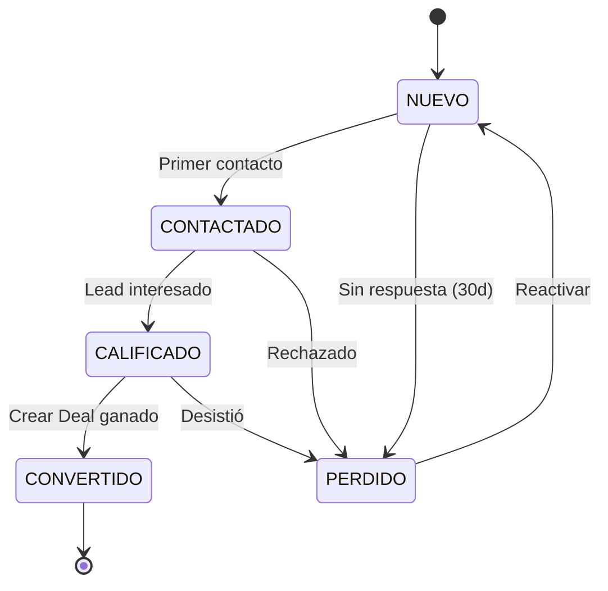
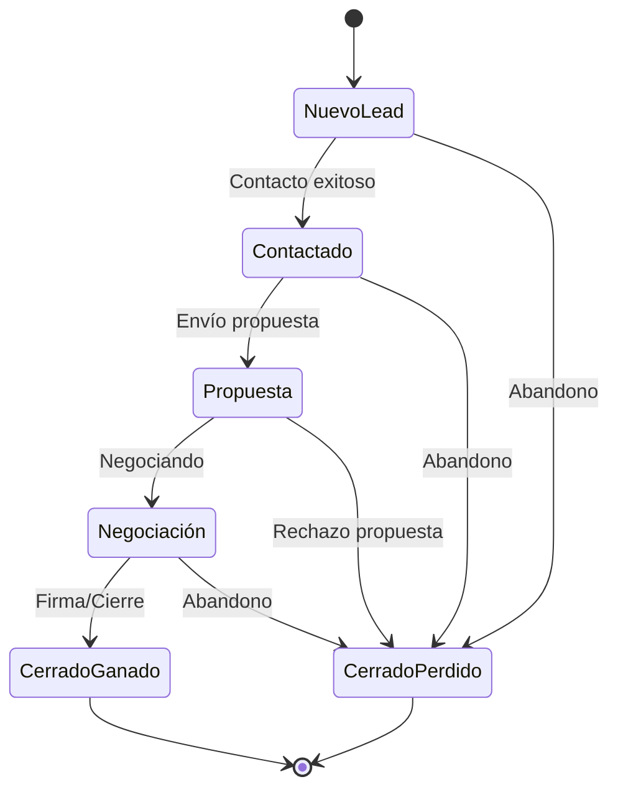
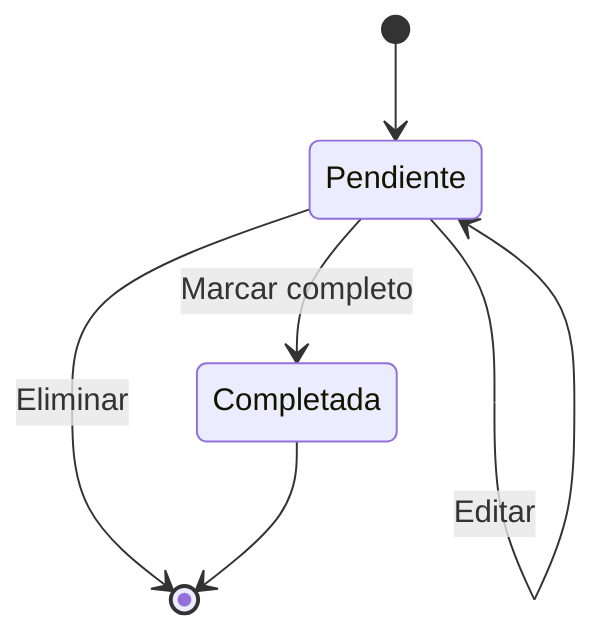

# Startup CRM - Lógica de Negocio

## 1. Arquitectura General

```
┌─────────────────────────────────────────────────────────────────────────────┐
│                              FRONTEND (React)                               │
│  ┌─────────┐ ┌──────────┐ ┌────────┐ ┌────────┐ ┌────────┐ ┌─────────┐ │
│  │Dashboard│ │ Contacts │ │ Deals  │ │ Tasks  │ │ Email  │ │WhatsApp │ │
│  └────┬────┘ └────┬─────┘ └───┬────┘ └───┬────┘ └───┬────┘ └───┬─────┘ │
└───────┼────────────┼───────────┼─────────┼──────────┼──────────┼────────┘
        │            │           │         │          │          │
        └────────────┴───────────┴─────────┴──────────┴──────────┘
                                 │ REST API
┌────────────────────────────────┼───────────────────────────────────────────┐
│                              BACKEND (Spring Boot)                         │
│  ┌──────────────┐  ┌──────────────┐  ┌──────────────┐  ┌──────────────┐ │
│  │   Contacts   │  │    Deals     │  │    Tasks     │  │  Analytics   │ │
│  │   Service    │  │   Service    │  │   Service   │  │   Service    │ │
│  └──────┬───────┘  └──────┬───────┘  └──────┬───────┘  └──────┬───────┘ │
│         │                  │                  │                  │          │
│  ┌──────┴──────────────────┴──────────────────┴──────────────────┴───────┐ │
│  │                         REPOSITORIES                                 │ │
│  └──────────────────────────────┬──────────────────────────────────────┘ │
│                                 │                                         │
│  ┌──────────────────────────────┴──────────────────────────────────────┐ │
│  │                      PostgreSQL DATABASE                              │ │
│  └───────────────────────────────────────────────────────────────────────┘ │
└───────────────────────────────────────────────────────────────────────────┘
                                 │
        ┌─────────────────────────┼─────────────────────────┐
        │                         │                         │
   ┌────┴────┐            ┌─────┴─────┐            ┌──────┴──────┐
   │ WhatsApp │            │   Email   │            │   SMTP /    │
   │  Cloud   │            │  Gmail    │            │   Brevo     │
   └──────────┘            └───────────┘            └─────────────┘
```

---

## 2. Módulos Core

### 2.1 Contacts (Gestión de Leads/Clientes)

#### Estados del Contacto (Funnel)
```
NUEVO → CONTACTADO → CALIFICADO → CONVERTIDO
   │         │            │            │
   └─────────┴────────────┴────────────┴──→ PERDIDO
```

#### Lógica de Estados
| Estado | Descripción | Transiciones Permitidas |
|--------|-------------|------------------------|
| NUEVO | Lead recién creado | CONTACTADO, PERDIDO |
| CONTACTADO | Primer contacto realizado | CALIFICADO, PERDIDO |
| CALIFICADO | Lead verificado/interesado | CONVERTIDO, PERDIDO |
| CONVERTIDO | Se creó un Deal asociado | - |
| PERDIDO | No progresó o se rechazó | NUEVO (reactivar) |

#### Reglas de Negocio
- **Email único** por workspace
- **Soft delete** (is_deleted = true)
- **Asignación** a usuarios del workspace
- **Tags** para segmentación adicional
- **Notas** con auditoría (quién, cuándo)

#### Campos Requeridos
- Nombre (requerido)
- Email (único por workspace)
- Teléfono
- Empresa (opcional)
- Cargo (opcional)
- Estado (default: NUEVO)
- Asignado a (default: creador)
- Tags (array)
- Notas (historial)

---

### 2.2 Deals (Oportunidades de Venta)

#### Pipeline por Defecto
```
┌────────────┬────────────┬────────────┬────────────┬────────────────┬────────────────┐
│ Nuevo Lead │ Contactado  │ Propuesta  │ Negociación│ Cerrado Ganado │ Cerrado Perdido│
│    #6366F1 │   #3B82F6  │  #F59E0B   │   #EF4444  │    #10B981    │    #6B7280     │
└────────────┴────────────┴────────────┴────────────┴────────────────┴────────────────┘
     LOW            MEDIUM          HIGH          HIGH             WON              LOST
```

#### Lógica de Etapas
| Etapa | Color | Es Ganada | Es Perdida |
|-------|-------|-----------|------------|
| Nuevo Lead | #6366F1 | ❌ | ❌ |
| Contactado | #3B82F6 | ❌ | ❌ |
| Propuesta | #F59E0B | ❌ | ❌ |
| Negociación | #EF4444 | ❌ | ❌ |
| Cerrado Ganado | #10B981 | ✅ | ❌ |
| Cerrado Perdido | #6B7280 | ❌ | ✅ |

#### Reglas de Negocio
- **Drag & Drop** entre etapas (con historial)
- **Valor** numérico con 2 decimales
- **Etapa inicial** configurable (default: Nuevo Lead)
- **Contactos** asociados
- **Empresas** asociadas
- **Fecha cierre esperada**
- **Soft delete**

#### Cálculos del Pipeline
```javascript
// Valor Total del Pipeline
totalPipelineValue = SUM(deals WHERE is_deleted = false AND stage NOT IN (won, lost))

// Valor por Etapa
stageValue = SUM(deals WHERE stage_id = X AND is_deleted = false)

// Tasa de Conversión
conversionRate = (deals_won / deals_total) * 100

// Tiempo Promedio en Etapa
avgTimeInStage = AVG(current_date - stage_entered_at) per stage
```

---

### 2.3 Tasks (Tareas y Seguimientos)

#### Prioridades
| Prioridad | Color | Descripción |
|-----------|-------|-------------|
| HIGH | 🔴 Red | Urgente, seguir inmediatamente |
| MEDIUM | 🟡 Yellow | Normal, seguir en 24-48h |
| LOW | ⚪ Gray | Cuando haya tiempo |

#### Estados
- **Pendiente** (is_completed = false)
- **Completada** (is_completed = true, completed_at, completed_by)

#### Reglas de Negocio
- **Vínculo opcional** con Contacto y/o Deal
- **Due date** (fecha vencimiento)
- **Asignación** a usuarios
- **Prioridad** (HIGH, MEDIUM, LOW)
- **Completar** registra quién y cuándo

#### Automatizaciones de Tareas
```
Trigger                          → Acción
─────────────────────────────────────────────────────
Email enviado sin respuesta (7d)  → Crear tarea follow-up
Deal en "Propuesta" (5d)         → Crear tarea seguimiento
Contacto sin actividad (14d)      → Crear tarea re-contactar
```

---

### 2.4 Conversations (Conversaciones)

#### Canales
| Canal | Entrante | Saliente | Integración |
|-------|----------|---------|-------------|
| WHATSAPP | ✅ Webhook | ✅ Meta API | WhatsApp Cloud |
| EMAIL | ✅ Webhook/Gmail | ✅ SMTP/Gmail | Gmail API / SMTP |

#### Estados de Conversación
```
OPEN → CLOSED → ARCHIVED
```

#### Estados de Mensaje
```
SENDING → SENT → DELIVERED → READ
            ↓
         FAILED (reintentar)
```

#### Lógica de Webhook (Idempotencia)
```javascript
// Meta WhatsApp webhook
if (message.external_id ya existe) {
    // Ignorar (already processed)
    return 200 OK;
}
// Crear mensaje y actualizar conversación
```

#### Find-or-Create Conversación
```javascript
findConversation(workspaceId, contactId, channel) {
    // Buscar conversación activa
    // Si existe → retornar
    // Si no existe → crear nueva
}
```

---

## 3. Integraciones

### 3.1 WhatsApp Cloud API (Meta)

#### Configuración
```javascript
WhatsAppConfig {
    phone_number_id: string,    // Meta Phone Number ID
    access_token: string,       // AES-256 encrypted
    webhook_verify_token: string, // AES-256 encrypted
    app_secret: string,        // AES-256 encrypted
    is_active: boolean
}
```

#### Flujo de Mensajes
```
┌──────────┐     ┌──────────┐     ┌──────────┐     ┌──────────┐
│ Cliente  │────▶│ Meta API │────▶│ Webhook  │────▶│   CRM    │
│ WhatsApp │     │          │     │ Receiver │     │          │
└──────────┘     └──────────┘     └──────────┘     └────┬─────┘
                                                         │
┌──────────┐     ┌──────────┐     ┌──────────┐         │
│   CRM    │────▶│ Meta API │────▶│ Cliente  │◀────────┘
│          │     │  (Send)  │     │ WhatsApp │
└──────────┘     └──────────┘     └──────────┘
```

#### Plantillas de Mensaje
- **Marketing**: Promociones, ofertas
- **Utility**: Confirmaciones, recordatorios
- **Authentication**: OTP, verificación

### 3.2 Email (SMTP + Gmail)

#### Configuraciones Soportadas
```javascript
// SMTP tradicional
SmtpConfig {
    host: string,
    port: number,      // 587 (TLS), 465 (SSL), 25 (sin encripción)
    username: string,
    password: string,   // AES-256 encrypted
    encryption: 'TLS' | 'SSL' | 'NONE'
}

// Gmail OAuth
GmailConfig {
    email: string,
    access_token: string,   // AES-256 encrypted
    refresh_token: string,   // AES-256 encrypted
    token_expires_at: datetime
}
```

#### Tracking de Email
```javascript
// Pixel de tracking (1x1 transparent GIF)
email_body += ''

// Links trackeados
original_link = "https://example.com"
tracked_link = "/api/email/click/{message_id}/{encode(original_link)}"
```

---

## 4. Automatizaciones (Workflows)

### Tipos de Trigger
| Módulo | Evento | Descripción |
|--------|--------|-------------|
| Contact | created | Nuevo contacto creado |
| Contact | status_changed | Cambio de estado |
| Deal | created | Nuevo deal |
| Deal | stage_changed | Cambio de etapa |
| Deal | won | Deal cerrado ganado |
| Deal | lost | Deal cerrado perdido |
| Task | completed | Tarea completada |
| Email | sent | Email enviado |
| Email | replied | Respuesta recibida |
| Schedule | daily | Ejecución diaria |
| Schedule | weekly | Ejecución semanal |

### Tipos de Acción
| Acción | Descripción |
|--------|-------------|
| send_email | Enviar email |
| create_task | Crear tarea |
| assign_contact | Asignar contacto |
| assign_deal | Asignar deal |
| change_stage | Cambiar etapa |
| change_status | Cambiar estado |
| notify | Notificar usuario |
| webhook | Llamar webhook externo |

### Ejemplos de Automatizaciones

```javascript
// Automation 1: Follow-up after no email response
{
    name: "Follow-up after 7 days",
    trigger: { type: "email_sent", after: "7d", no_reply: true },
    actions: [
        { type: "create_task", config: {
            title: "Follow-up: {{contact_name}}",
            due_at: "now",
            priority: "HIGH"
        }}
    ]
}

// Automation 2: Welcome email
{
    name: "Welcome new contact",
    trigger: { type: "contact_created" },
    conditions: [
        { field: "source", equals: "website" }
    ],
    actions: [
        { type: "send_email", config: {
            template: "welcome",
            delay: "1h"
        }}
    ]
}

// Automation 3: Deal won celebration
{
    name: "Notify team on win",
    trigger: { type: "deal_won" },
    actions: [
        { type: "notify", config: {
            channel: "in_app",
            message: "🎉 Deal \"{{deal_name}}\" closed by {{assigned_to}}!"
        }},
        { type: "send_email", config: {
            to: "team@company.com",
            template: "deal_won"
        }}
    ]
}

// Automation 4: Stale deal alert
{
    name: "Stale deal reminder",
    trigger: { type: "schedule_daily" },
    actions: [
        { type: "create_task", condition: "deals_no_activity_14d", config: {
            title: "Review stale deal: {{deal_name}}",
            assigned_to: "{{assigned_to}}"
        }}
    ]
}
```

---

## 5. Analytics y Métricas

### 5.1 KPIs Principales

#### Contact Metrics
```javascript
totalContacts = COUNT(contacts WHERE is_deleted = false)
newContactsThisMonth = COUNT(contacts WHERE created_at >= start_of_month)
contactsByStatus = GROUP BY status COUNT(*)
contactsBySource = GROUP BY source COUNT(*)
```

#### Deal Metrics
```javascript
totalPipelineValue = SUM(deals.value WHERE is_deleted = false AND stage NOT IN (won, lost))
wonDealsValue = SUM(deals.value WHERE stage = won)
lostDealsValue = SUM(deals.value WHERE stage = lost)
conversionRate = wonDeals / (wonDeals + lostDeals) * 100
avgDealValue = AVG(deals.value WHERE is_deleted = false)
```

#### Activity Metrics
```javascript
emailsSent = COUNT(messages WHERE channel = email AND direction = outbound)
emailsOpened = COUNT(messages WHERE email_opened = true)
emailsClicked = COUNT(messages WHERE links_clicked > 0)
whatsappSent = COUNT(messages WHERE channel = whatsapp AND direction = outbound)
tasksCompleted = COUNT(tasks WHERE is_completed = true)
```

#### Time Metrics
```javascript
avgResponseTime = AVG(sent_at - received_at) for replies
avgDealCycleTime = AVG(closed_at - created_at) for won deals
avgTimeInStage = AVG(time_in_each_stage) GROUP BY stage
```

### 5.2 Dashboard Widgets

| Widget | Tipo | Datos |
|--------|------|-------|
| Contacts Overview | Card | Total, nuevo mes, % cambio |
| Pipeline Value | Card | Total, ganados, perdidos |
| Conversion Funnel | Chart | Leads → Clientes |
| Pipeline Stages | Kanban | Deals por etapa con valores |
| Activity Feed | List | Últimas 10 actividades |
| Top Performers | Table | Usuarios rankeados |
| Response Time | Chart | Tiempo promedio respuesta |
| Email Stats | Chart | Enviados, abiertos, clicks |

---

## 6. Exportación de Datos

### 6.1 Formatos Soportados
- **CSV**: Tablas planas, máximo 10,000 registros
- **PDF**: Reportes formateados con gráficos
- **XLSX**: Excel con múltiples sheets

### 6.2 Tipos de Exportación
```javascript
ExportRequest {
    entity: 'contacts' | 'deals' | 'tasks' | 'conversations',
    filters: FilterObject,
    columns: string[],        // Campos a incluir
    format: 'csv' | 'pdf' | 'xlsx',
    dateRange: { from, to },
    filename: string
}
```

### 6.3 Templates de Exportación
```javascript
// Contact Export Template
contact_export = [
    'id', 'name', 'email', 'phone', 'company',
    'status', 'assigned_to', 'created_at', 'tags'
]

// Deal Export Template  
deal_export = [
    'id', 'name', 'value', 'stage', 'contact',
    'company', 'assigned_to', 'expected_close', 'created_at'
]

// Task Export Template
task_export = [
    'id', 'title', 'contact', 'deal', 'assigned_to',
    'due_at', 'priority', 'is_completed', 'completed_at'
]
```

---

## 7. Flujos de Usuario Principales

### 7.1 Flujo: Nuevo Lead → Cliente
```
1. Admin/Vendedor crea contacto
   → Contacto estado: NUEVO
   
2. Vendedor contacta (email/WhatsApp/teléfono)
   → Contacto estado: CONTACTADO
   → Se crea nota de contacto
   
3. Vendedor califica lead
   → Contacto estado: CALIFICADO
   → Se crea nota de calificación
   
4. Vendedor crea Deal asociado
   → Deal etapa: Nuevo Lead
   → Contacto linked to Deal
   
5. Deal avanza por pipeline
   → Contactado → Propuesta → Negociación
   
6. Deal cerrado
   → Cerrado Ganado → Contacto estado: CONVERTIDO
   → O: Cerrado Perdido → Contacto estado: PERDIDO
   
7. Sistema crea tarea de seguimiento automático
```

### 7.2 Flujo: Mensajería
```
1. Cliente envía WhatsApp
   → Webhook recibe mensaje
   → Buscar/crear contacto por teléfono
   → Crear/actualizar conversación
   → Agregar mensaje a conversación
   
2. Notificación al vendedor asignado
   → In-app notification
   → Badge count
   
3. Vendedor responde desde CRM
   → Enviar vía Meta API
   → Mensaje status: SENDING → SENT → DELIVERED → READ
   
4. Cliente responde
   → Loop continúa
```

### 7.3 Flujo: Email Marketing
```
1. Admin configura SMTP o Gmail OAuth
   → Guardar credenciales encriptadas
   → Probar conexión
   
2. Admin crea plantilla de email
   → Variables: {{contact_name}}, {{company}}, etc.
   → Preview con datos de prueba
   
3. Vendedor selecciona contactos (o segmento)
   → Aplica variables a plantilla
   → Adjunta archivos opcionales
   → Programa envío o envía inmediatamente
   
4. Sistema envía emails
   → Rate limiting (100/hora por default)
   → Tracking pixel insertado
   → Links trackeados
   
5. Cliente abre/clickea
   → Se registra en mensaje
   → Se actualiza badge en CRM
   
6. Si no hay respuesta en 7 días
   → Automation: crear tarea follow-up
```

---

## 8. Seguridad y Permisos (RBAC)

### 8.1 Roles
| Rol | Descripción |
|-----|-------------|
| ADMIN | Administrador workspace - acceso total |
| MANAGER | Gestor equipo - CRUD contactos/deals, ver analytics |
| SALES | Vendedor - CRUD en su área asignada |
| SUPPORT | Atención - leer contactos, gestionar conversaciones |
| VIEWER | Solo lectura - ver dashboard y reports |

### 8.2 Matriz de Permisos
| Recurso | ADMIN | MANAGER | SALES | SUPPORT | VIEWER |
|----------|-------|---------|-------|---------|--------|
| Contacts CRUD | ✅ | ✅ | ✅* | Read | ❌ |
| Deals CRUD | ✅ | ✅ | ✅* | ❌ | ❌ |
| Tasks CRUD | ✅ | ✅ | ✅* | Read | ❌ |
| Conversations | ✅ | ✅ | ✅ | ✅ | ❌ |
| Analytics | ✅ | ✅ | ✅ | ❌ | ✅ |
| Settings | ✅ | ❌ | ❌ | ❌ | ❌ |
| Users | ✅ (manage) | ❌ | ❌ | ❌ | ❌ |
| Integrations | ✅ | ❌ | ❌ | ❌ | ❌ |

*Solo en registros asignados a ellos

### 8.3 Multi-Tenancy
```javascript
// Cada query incluye workspace_id
const query = {
    workspace_id: currentUser.workspace_id,
    ...filters
}

// WorkspaceContext extraído del JWT
workspaceId = JWT.claims.workspace_id
```

---

## 9. Estados y Transiciones

### 9.1 Contacto


### 9.2 Deal


### 9.3 Tarea


---

## 10. Validaciones

### 10.1 Contacto
```javascript
validations: {
    name: { required: true, minLength: 1, maxLength: 255 },
    email: { 
        required: false, 
        format: 'email',
        unique: 'workspace_id + email'
    },
    phone: { format: 'phone', optional: true },
    status: { enum: ['NUEVO', 'CONTACTADO', 'CALIFICADO', 'CONVERTIDO', 'PERDIDO'] }
}
```

### 10.2 Deal
```javascript
validations: {
    name: { required: true, minLength: 1, maxLength: 255 },
    value: { min: 0, max: 999999999999.99 },
    stage_id: { required: true, exists: 'pipeline_stages' },
    expected_close_date: { min: 'today' },
    contact_id: { optional: true, exists: 'contacts' }
}
```

### 10.3 Tarea
```javascript
validations: {
    title: { required: true, minLength: 1, maxLength: 255 },
    due_at: { optional: true, min: 'now' },
    priority: { enum: ['HIGH', 'MEDIUM', 'LOW'] },
    assigned_to: { optional: true, exists: 'users' },
    contact_id: { optional: true, exists: 'contacts' },
    deal_id: { optional: true, exists: 'deals' }
}
```

---

## 11. Eventos y Notificaciones

### 11.1 Tipos de Notificación
| Tipo | Canal | Descripción |
|------|-------|-------------|
| in_app | Frontend | Badge + Toast |
| email | SMTP | Email al usuario |
| push | Browser | Push notification |

### 11.2 Triggers de Notificación
```javascript
notifications: {
    new_message: { user: 'assigned_to', channel: ['in_app'] },
    task_assigned: { user: 'assigned_to', channel: ['in_app', 'email'] },
    task_due_soon: { user: 'assigned_to', channel: ['in_app'] },
    deal_assigned: { user: 'assigned_to', channel: ['in_app'] },
    deal_stage_changed: { user: 'assigned_to', channel: ['in_app'] },
    deal_won: { user: 'all_admins', channel: ['in_app', 'email'] },
    new_contact_assigned: { user: 'assigned_to', channel: ['in_app'] }
}
```

---

## 12. Consideraciones Técnicas

### 12.1 Encriptación
- **Credenciales**: AES-256-GCM (EncryptionService)
- **Tokens JWT**: HMAC-SHA256
- **Passwords**: BCrypt (strength 10)
- **Refresh Tokens**: SHA-256 hash

### 12.2 Rate Limiting
```javascript
rateLimits: {
    'api/auth/login': '5/min/IP',
    'api/contacts': '100/min/user',
    'api/deals': '100/min/user',
    'api/messages/send': '60/min/user',
    'api/email/send': '100/hour/workspace'
}
```

### 12.3 Índices de Performance
```sql
-- Contactos por workspace y email (único)
CREATE UNIQUE INDEX idx_contacts_workspace_email ON contacts(workspace_id, email) WHERE email IS NOT NULL;

-- Contactos activos por workspace y status
CREATE INDEX idx_contacts_workspace_status ON contacts(workspace_id, status) WHERE is_deleted = FALSE;

-- Deals por workspace y etapa
CREATE INDEX idx_deals_workspace_stage ON deals(workspace_id, stage_id);

-- Mensajes por external_id (webhook idempotencia)
CREATE UNIQUE INDEX idx_messages_external_id ON messages(external_id) WHERE external_id IS NOT NULL;

-- Conversaciones activas por workspace + contacto + canal
CREATE INDEX idx_conversations_lookup ON conversations(workspace_id, contact_id, channel);
```

---

## 13. Próximos Pasos (Roadmap)

### Fase 1 - MVP (Completado)
- [x] Auth + JWT
- [x] Contacts CRUD
- [x] Deals Pipeline
- [x] Tasks
- [x] WhatsApp Integration
- [x] Email Integration
- [x] Dashboard Analytics

### Fase 2 - Enhancement
- [ ] Google OAuth
- [ ] Plantillas de Email/WhatsApp
- [ ] Email/Link Tracking
- [ ] Automation Builder
- [ ] Import CSV
- [ ] Reporting avanzado

### Fase 3 - Scale
- [ ] Webhooks externos
- [ ] API pública
- [ ] Multi-idioma
- [ ] Mobile app
- [ ] AI/ML lead scoring
