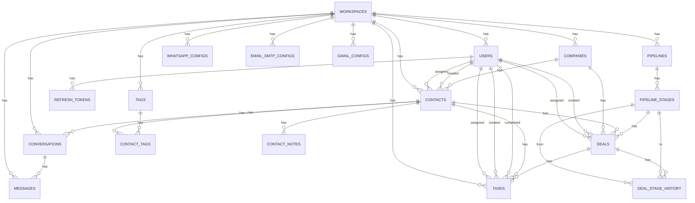

# Diagrama Entidad-Relación - Startup CRM

## Vistas General

## Entidades Detalladas

### workspaces

| Campo | Tipo | Constraints | Descripcion |
|-------|------|-------------|-------------|
| id | UUID | PK | Identificador unico |
| name | VARCHAR(255) | NOT NULL | Nombre del workspace |
| slug | VARCHAR(100) | UNIQUE | Slug URL-friendly |
| plan | VARCHAR(50) | NOT NULL, DEFAULT 'FREE' | Plan (FREE, PRO, ENTERPRISE) |
| timezone | VARCHAR(100) | NOT NULL, DEFAULT 'UTC' | Zona horaria |
| created_by | UUID | FK → users(id) | Usuario creador |
| created_at | TIMESTAMPTZ | NOT NULL | Fecha creacion |
| updated_at | TIMESTAMPTZ | NOT NULL | Fecha actualizacion |

### users

| Campo | Tipo | Constraints | Descripcion |
|-------|------|-------------|-------------|
| id | UUID | PK | Identificador unico |
| workspace_id | UUID | FK → workspaces(id), NOT NULL | Workspace al que pertenece |
| email | VARCHAR(255) | UNIQUE, NOT NULL | Email unico global |
| password_hash | VARCHAR(255) | | Hash BCrypt (null si Google OAuth) |
| name | VARCHAR(255) | NOT NULL | Nombre completo |
| phone | VARCHAR(50) | | Telefono |
| timezone | VARCHAR(100) | NOT NULL, DEFAULT 'UTC' | Zona horaria preferida |
| role | VARCHAR(20) | NOT NULL, CHECK | ADMIN, MANAGER, SALES |
| is_active | BOOLEAN | NOT NULL, DEFAULT TRUE | Estado de actividad |
| google_id | VARCHAR(255) | | ID de Google OAuth |
| created_by | UUID | FK → users(id) | Usuario creador |
| created_at | TIMESTAMPTZ | NOT NULL | Fecha creacion |
| updated_at | TIMESTAMPTZ | NOT NULL | Fecha actualizacion |

### refresh_tokens

| Campo | Tipo | Constraints | Descripcion |
|-------|------|-------------|-------------|
| id | UUID | PK | Identificador unico |
| token_hash | VARCHAR(255) | UNIQUE, NOT NULL | SHA-256 del token |
| user_id | UUID | FK → users(id), NOT NULL | Usuario propietario |
| expires_at | TIMESTAMPTZ | NOT NULL | Fecha expiracion |
| revoked_at | TIMESTAMPTZ | | Fecha revocacion (null = activo) |
| created_at | TIMESTAMPTZ | NOT NULL | Fecha creacion |

### companies

| Campo | Tipo | Constraints | Descripcion |
|-------|------|-------------|-------------|
| id | UUID | PK | Identificador unico |
| workspace_id | UUID | FK → workspaces(id), NOT NULL | Workspace |
| name | VARCHAR(255) | NOT NULL | Nombre empresa |
| domain | VARCHAR(255) | | Dominio web |
| industry | VARCHAR(100) | | Industria |
| created_by | UUID | FK → users(id) | Usuario creador |
| created_at | TIMESTAMPTZ | NOT NULL | Fecha creacion |
| updated_at | TIMESTAMPTZ | NOT NULL | Fecha actualizacion |

### contacts

| Campo | Tipo | Constraints | Descripcion |
|-------|------|-------------|-------------|
| id | UUID | PK | Identificador unico |
| workspace_id | UUID | FK → workspaces(id), NOT NULL | Workspace |
| company_id | UUID | FK → companies(id) | Empresa asociada |
| assigned_to | UUID | FK → users(id) | Usuario asignado |
| created_by | UUID | FK → users(id) | Usuario creador |
| name | VARCHAR(255) | NOT NULL | Nombre completo |
| email | VARCHAR(255) | UNIQUE parcial | Email unico por workspace |
| phone | VARCHAR(50) | | Telefono |
| job_title | VARCHAR(255) | | Cargo |
| status | VARCHAR(20) | NOT NULL, CHECK | NEW, CONTACTED, QUALIFIED, LOST, CONVERTED |
| is_deleted | BOOLEAN | NOT NULL, DEFAULT FALSE | Soft delete |
| created_at | TIMESTAMPTZ | NOT NULL | Fecha creacion |
| updated_at | TIMESTAMPTZ | NOT NULL | Fecha actualizacion |

### tags

| Campo | Tipo | Constraints | Descripcion |
|-------|------|-------------|-------------|
| id | UUID | PK | Identificador unico |
| workspace_id | UUID | FK → workspaces(id), NOT NULL | Workspace |
| name | VARCHAR(100) | UNIQUE parcial | Nombre unico por workspace |
| color | VARCHAR(20) | | Color hexadecimal |
| created_by | UUID | FK → users(id) | Usuario creador |
| created_at | TIMESTAMPTZ | NOT NULL | Fecha creacion |
| updated_at | TIMESTAMPTZ | NOT NULL | Fecha actualizacion |

### contact_tags

| Campo | Tipo | Constraints | Descripcion |
|-------|------|-------------|-------------|
| contact_id | UUID | PK, FK → contacts(id) | Contacto |
| tag_id | UUID | PK, FK → tags(id) | Etiqueta |

### contact_notes

| Campo | Tipo | Constraints | Descripcion |
|-------|------|-------------|-------------|
| id | UUID | PK | Identificador unico |
| workspace_id | UUID | FK → workspaces(id), NOT NULL | Workspace |
| contact_id | UUID | FK → contacts(id), NOT NULL | Contacto |
| created_by | UUID | FK → users(id) | Autor de la nota |
| body | TEXT | NOT NULL | Contenido |
| created_at | TIMESTAMPTZ | NOT NULL | Fecha creacion |
| updated_at | TIMESTAMPTZ | NOT NULL | Fecha actualizacion |

### pipelines

| Campo | Tipo | Constraints | Descripcion |
|-------|------|-------------|-------------|
| id | UUID | PK | Identificador unico |
| workspace_id | UUID | FK → workspaces(id), NOT NULL | Workspace |
| name | VARCHAR(255) | NOT NULL | Nombre del pipeline |
| is_default | BOOLEAN | NOT NULL, DEFAULT FALSE | Pipeline por defecto |
| created_by | UUID | FK → users(id) | Usuario creador |
| created_at | TIMESTAMPTZ | NOT NULL | Fecha creacion |
| updated_at | TIMESTAMPTZ | NOT NULL | Fecha actualizacion |

### pipeline_stages

| Campo | Tipo | Constraints | Descripcion |
|-------|------|-------------|-------------|
| id | UUID | PK | Identificador unico |
| workspace_id | UUID | FK → workspaces(id), NOT NULL | Workspace |
| pipeline_id | UUID | FK → pipelines(id), NOT NULL | Pipeline padre |
| name | VARCHAR(255) | NOT NULL | Nombre etapa |
| color | VARCHAR(20) | | Color hexadecimal |
| position | INT | NOT NULL, DEFAULT 0 | Orden visual |
| stage_order | INTEGER | | Orden alternativo |
| is_won | BOOLEAN | NOT NULL, DEFAULT FALSE | Marca como ganado |
| is_lost | BOOLEAN | NOT NULL, DEFAULT FALSE | Marca como perdido |
| created_by | UUID | FK → users(id) | Usuario creador |
| created_at | TIMESTAMPTZ | NOT NULL | Fecha creacion |
| updated_at | TIMESTAMPTZ | NOT NULL | Fecha actualizacion |

### deals

| Campo | Tipo | Constraints | Descripcion |
|-------|------|-------------|-------------|
| id | UUID | PK | Identificador unico |
| workspace_id | UUID | FK → workspaces(id), NOT NULL | Workspace |
| name | VARCHAR(255) | NOT NULL | Nombre negocio |
| value | NUMERIC(15,2) | | Valor monetario |
| stage_id | UUID | FK → pipeline_stages(id) | Etapa actual |
| contact_id | UUID | FK → contacts(id) | Contacto principal |
| company_id | UUID | FK → companies(id) | Empresa |
| assigned_to | UUID | FK → users(id) | Usuario asignado |
| created_by | UUID | FK → users(id) | Usuario creador |
| expected_close_date | DATE | | Fecha esperada cierre |
| is_deleted | BOOLEAN | NOT NULL, DEFAULT FALSE | Soft delete |
| created_at | TIMESTAMPTZ | NOT NULL | Fecha creacion |
| updated_at | TIMESTAMPTZ | NOT NULL | Fecha actualizacion |

### deal_stage_history

| Campo | Tipo | Constraints | Descripcion |
|-------|------|-------------|-------------|
| id | UUID | PK | Identificador unico |
| deal_id | UUID | FK → deals(id), NOT NULL | Negocio |
| from_stage_id | UUID | FK → pipeline_stages(id) | Etapa origen |
| to_stage_id | UUID | FK → pipeline_stages(id) | Etapa destino |
| changed_by | UUID | FK → users(id) | Usuario que hizo el cambio |
| changed_at | TIMESTAMPTZ | NOT NULL | Fecha del cambio |

### conversations

| Campo | Tipo | Constraints | Descripcion |
|-------|------|-------------|-------------|
| id | UUID | PK | Identificador unico |
| workspace_id | UUID | FK → workspaces(id), NOT NULL | Workspace |
| contact_id | UUID | FK → contacts(id), NOT NULL | Contacto |
| channel | VARCHAR(20) | NOT NULL, CHECK | WHATSAPP, EMAIL |
| status | VARCHAR(20) | NOT NULL, DEFAULT 'OPEN', CHECK | OPEN, CLOSED, ARCHIVED |
| last_message_at | TIMESTAMPTZ | | Ultimo mensaje |
| created_by | UUID | FK → users(id) | Usuario creador |
| created_at | TIMESTAMPTZ | NOT NULL | Fecha creacion |
| updated_at | TIMESTAMPTZ | NOT NULL | Fecha actualizacion |

### messages

| Campo | Tipo | Constraints | Descripcion |
|-------|------|-------------|-------------|
| id | UUID | PK | Identificador unico |
| conversation_id | UUID | FK → conversations(id), NOT NULL | Conversacion |
| workspace_id | UUID | FK → workspaces(id), NOT NULL | Workspace |
| channel | VARCHAR(20) | NOT NULL, CHECK | WHATSAPP, EMAIL |
| direction | VARCHAR(10) | NOT NULL, CHECK | INBOUND, OUTBOUND |
| body | TEXT | | Contenido del mensaje |
| external_id | VARCHAR(255) | UNIQUE parcial | ID externo (webhook) |
| status | VARCHAR(20) | NOT NULL, DEFAULT 'SENT', CHECK | SENDING, SENT, DELIVERED, READ, FAILED |
| sent_at | TIMESTAMPTZ | | Fecha envio |
| delivered_at | TIMESTAMPTZ | | Fecha entrega |
| read_at | TIMESTAMPTZ | | Fecha lectura |
| created_by | UUID | FK → users(id) | Usuario creador |

### tasks

| Campo | Tipo | Constraints | Descripcion |
|-------|------|-------------|-------------|
| id | UUID | PK | Identificador unico |
| workspace_id | UUID | FK → workspaces(id), NOT NULL | Workspace |
| title | VARCHAR(255) | NOT NULL | Titulo |
| description | TEXT | | Descripcion |
| priority | VARCHAR(20) | NOT NULL, DEFAULT 'MEDIUM' | LOW, MEDIUM, HIGH |
| due_at | TIMESTAMPTZ | | Fecha vencimiento |
| is_completed | BOOLEAN | NOT NULL, DEFAULT FALSE | Completada |
| completed_at | TIMESTAMPTZ | | Fecha completado |
| completed_by | UUID | FK → users(id) | Usuario que completo |
| contact_id | UUID | FK → contacts(id) | Contacto asociado |
| deal_id | UUID | FK → deals(id) | Negocio asociado |
| assigned_to | UUID | FK → users(id) | Usuario asignado |
| created_by | UUID | FK → users(id) | Usuario creador |
| created_at | TIMESTAMPTZ | NOT NULL | Fecha creacion |
| updated_at | TIMESTAMPTZ | NOT NULL | Fecha actualizacion |

### whatsapp_configs

| Campo | Tipo | Constraints | Descripcion |
|-------|------|-------------|-------------|
| id | UUID | PK | Identificador unico |
| workspace_id | UUID | FK → workspaces(id), NOT NULL | Workspace |
| phone_number_id | VARCHAR(255) | NOT NULL | Phone Number ID de Meta |
| access_token | TEXT | NOT NULL | Token (AES-256 encrypted) |
| webhook_verify_token | TEXT | NOT NULL | Token verificacion webhook |
| app_secret | TEXT | | App Secret de Meta |
| connected_at | TIMESTAMPTZ | | Fecha conexion |
| is_active | BOOLEAN | NOT NULL, DEFAULT TRUE | Activo |
| created_by | UUID | FK → users(id) | Usuario creador |
| created_at | TIMESTAMPTZ | NOT NULL | Fecha creacion |
| updated_at | TIMESTAMPTZ | NOT NULL | Fecha actualizacion |

### email_smtp_configs

| Campo | Tipo | Constraints | Descripcion |
|-------|------|-------------|-------------|
| id | UUID | PK | Identificador unico |
| workspace_id | UUID | FK → workspaces(id), NOT NULL | Workspace |
| host | VARCHAR(255) | NOT NULL | Servidor SMTP |
| port | INTEGER | NOT NULL | Puerto |
| username | VARCHAR(255) | NOT NULL | Usuario SMTP |
| password | TEXT | NOT NULL | Contrasena (AES-256 encrypted) |
| encryption | VARCHAR(10) | NOT NULL, DEFAULT 'TLS', CHECK | NONE, SSL, TLS |
| is_active | BOOLEAN | NOT NULL, DEFAULT TRUE | Activo |
| created_by | UUID | FK → users(id) | Usuario creador |
| created_at | TIMESTAMPTZ | NOT NULL | Fecha creacion |
| updated_at | TIMESTAMPTZ | NOT NULL | Fecha actualizacion |

### gmail_configs

| Campo | Tipo | Constraints | Descripcion |
|-------|------|-------------|-------------|
| id | UUID | PK | Identificador unico |
| workspace_id | UUID | FK → workspaces(id), NOT NULL | Workspace |
| email | VARCHAR(255) | NOT NULL | Email Gmail |
| access_token | TEXT | NOT NULL | Access Token (AES-256 encrypted) |
| refresh_token | TEXT | NOT NULL | Refresh Token (AES-256 encrypted) |
| token_expires_at | TIMESTAMPTZ | | Expiracion del token |
| is_active | BOOLEAN | NOT NULL, DEFAULT TRUE | Activo |
| created_by | UUID | FK → users(id) | Usuario creador |
| created_at | TIMESTAMPTZ | NOT NULL | Fecha creacion |
| updated_at | TIMESTAMPTZ | NOT NULL | Fecha actualizacion |

## Resumen de Tablas

| # | Tabla | Descripcion | Foreign Keys |
|---|-------|-------------|--------------|
| 1 | workspaces | Multi-tenant workspaces | - |
| 2 | users | Usuarios del workspace | workspace_id, created_by |
| 3 | refresh_tokens | Tokens de refresh (JWT rotation) | user_id |
| 4 | companies | Empresas/Organizaciones | workspace_id, created_by |
| 5 | contacts | Contactos con soft-delete | workspace_id, company_id, assigned_to, created_by |
| 6 | tags | Etiquetas por workspace | workspace_id, created_by |
| 7 | contact_tags | Relación N:M contacts-tags | contact_id, tag_id |
| 8 | contact_notes | Notas de contactos | workspace_id, contact_id, created_by |
| 9 | pipelines | Pipeline de ventas | workspace_id, created_by |
| 10 | pipeline_stages | Etapas del pipeline | workspace_id, pipeline_id, created_by |
| 11 | deals | Negociaciones con soft-delete | workspace_id, stage_id, contact_id, company_id, assigned_to, created_by |
| 12 | deal_stage_history | Historial de cambios de etapa | deal_id, from_stage_id, to_stage_id, changed_by |
| 13 | conversations | Conversaciones por canal | workspace_id, contact_id, created_by |
| 14 | messages | Mensajes de conversaciones | conversation_id, workspace_id, created_by |
| 15 | tasks | Tareas asociadas a contactos/deals | workspace_id, contact_id, deal_id, assigned_to, created_by, completed_by |
| 16 | whatsapp_configs | Configuracion WhatsApp Business | workspace_id, created_by |
| 17 | email_smtp_configs | Configuracion SMTP | workspace_id, created_by |
| 18 | gmail_configs | Configuracion Gmail OAuth | workspace_id, created_by |

## Indices Principales

| Tabla | Indice | Tipo | Proposito |
|-------|--------|------|-----------|
| users | email | UNIQUE | Login rapido |
| users | workspace_id | INDEX | Filtrado por workspace |
| contacts | workspace_id, email | UNIQUE (partial) | Email unico por workspace |
| contacts | workspace_id, status | INDEX (partial) | Filtro status activos |
| messages | external_id | UNIQUE (partial) | Idempotencia webhooks |
| whatsapp_configs | workspace_id (where is_active) | UNIQUE | Solo 1 config activa |
| email_smtp_configs | workspace_id (where is_active) | UNIQUE | Solo 1 config activa |
| gmail_configs | workspace_id (where is_active) | UNIQUE | Solo 1 config activa |

## Migraciones

| Version | Archivo | Descripcion |
|---------|---------|-------------|
| V1 | V1__create_workspace_and_users.sql | Tablas base: workspaces, users, refresh_tokens |
| V2 | V2__create_contacts_companies_tags.sql | Companies, contacts, tags, contact_tags, contact_notes |
| V3 | V3__create_deals_pipeline.sql | Pipelines, pipeline_stages, deals, deal_stage_history |
| V4 | V4__create_conversations_messages.sql | Conversations, messages |
| V5 | V5__create_tasks.sql | Tasks |
| V6 | V6__create_integrations_settings.sql | whatsapp_configs, email_smtp_configs, gmail_configs |
| V7 | V7__seed_default_pipeline.sql | Funcion para crear pipeline por defecto |
| V8 | V8__add_whatsapp_app_secret.sql | Agrega app_secret a whatsapp_configs |
| V9 | V9__add_created_by_to_all_tables.sql | Agrega created_by faltante |
| V10 | V10__add_stage_order_to_stages.sql | Agrega stage_order a pipeline_stages |
| V11 | V11__fix_workspace_and_user_columns.sql | Fix columnas faltantes en workspaces y users |
